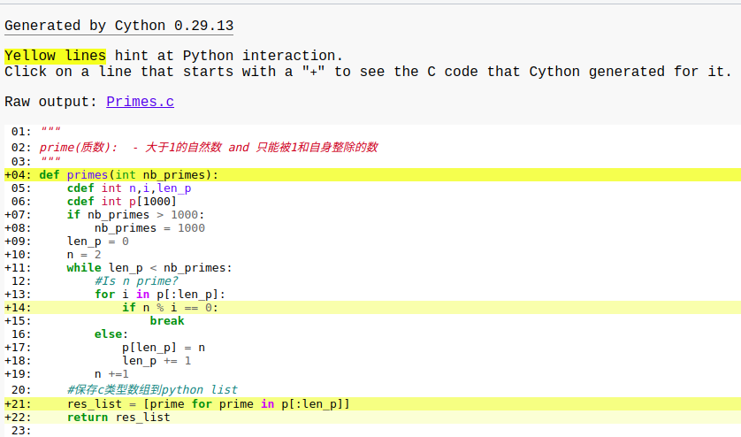
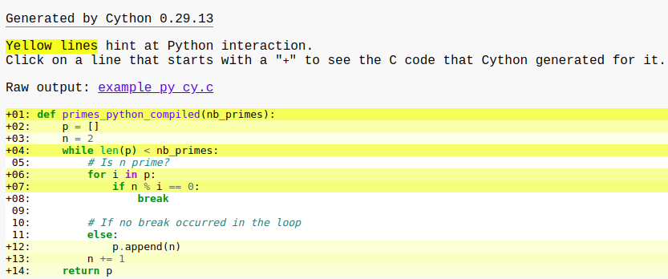

### Basic Tutorial

#### 案例: 

查找质数，给定要查找质数的数量,返回对应数量的质数列表

参考官网:  <http://docs.cython.org/en/latest/src/tutorial/cython_tutorial.html>

- 1、cython版本,新建example.pyx文件

  ```cython
  """
  prime(质数):  - 大于1的自然数 and 只能被1和自身整除的数
  """
  def primes(int nb_primes):
      cdef int n,i,len_p
      cdef int p[1000]
      if nb_primes > 1000:
          nb_primes = 1000
      len_p = 0
      n = 2
      while len_p < nb_primes:
          #Is n prime?
          for i in p[:len_p]:
              if n % i == 0:
                  break
          else:
              p[len_p] = n
              len_p += 1
          n +=1
      #保存c类型数组到python list
      res_list = [prime for prime in p[:len_p]]
      return res_list
  ```

- 2 、纯python版本,新建example_py_cy.py

  ```python
  def primes_python_compiled(nb_primes):
      p = []
      n = 2
      while len(p) < nb_primes:
          # Is n prime?
          for i in p:
              if n % i == 0:
                  break
  
          # If no break occurred in the loop
          else:
              p.append(n)
          n += 1
      return p
  ```

- 3、编译，通过cython既可以编译`.pyx`文件也可以编译`.py`文件。新建setup.py

  ```python
  #touch setup.py
  from distutils.core import setup
  from Cython.Build import cythonize
  
  setup (
      ext_modules = cythonize(["example.pyx",
                               "example_py_cy.py"],
                               annotate=True)
  )
  ```

  > **命令行编译** : `$ python3 setup.py build_ext --inplace`，每个被编译文件会对应生成三个文件

  | 编译文件 | example.pyx             | example_py_cy.py     | 备注                                                         |
  | -------- | ----------------------- | -------------------- | ------------------------------------------------------------ |
  | 生成文件 | example.c               | example_py_cy.c      | cython编译生成的C源码文件                                    |
  |          | example.cexample.xxx.so | example_py_cy.xxx.so | 编译生成的二进制文件,可以通过import导入使用，模块名为exampel, example_py_cy |
  |          | example.html            | example_py_cy.html   | 当setup.py中cythonize的annotate为True时会生成的文件，里面可以显示的看到你写的代码那些是和python交互的，那些是直接与C交互的,如下图 |

  																	Fig1 example.html

  															Fig 2example_py_cy.html

  **总结：**Fig1和Fig2分别表示代码example.pyx,example_py_cy.py文件中代码与python或C的交互程度，其中白色表示直接与C交互，而黄色表示与python交互，黄色越深表示与python的交互越多，即执行效率相对教慢。

- 4 编译模块的使用

  ```python
  #touch test.py
  import example
  import example_py_cy
  import time
  t1 = time.time()
  print(example.primes(10))
  print('cython-primes:',time.time()-t1)
  t1 = time.time()
  print(example_py_cy.primes_python_compiled(10))
  print('python-primes:',time.time()-t1)
  ```


